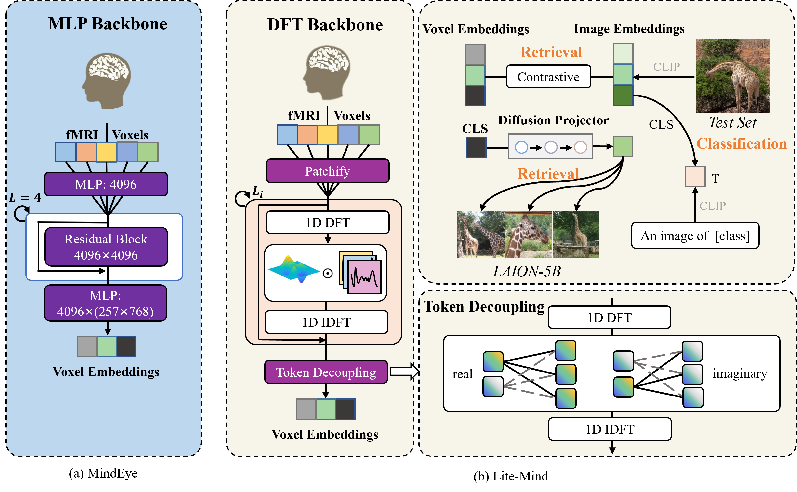

# <center>Lite-Mind</center>

This is the official code for the paper "Lite-Mind:Towards Efficient and Robust Brain Representation Learning", which is an efficient model for fMRI decoding (<font color='blue' size=4>https://arxiv.org/abs/2312.03781</font>).[<font color='blue' size=4>**ACMMM 2024 Oral**</font>]



## Installation
```python
conda create -n litemind python==3.8.5
conda activate litemind
pip install -r requirement.txt
```

## Data Preprocessing
1. Download `nsddata`, `nsddata_betas`, and `nsddata_stimuli` from NSD (http://naturalscenesdataset.org/) and place them under the nsd directory. 

2. Extraction of nsdgeneral roi from raw fMRI.
```python
python src/fmri2nsd.py --subject subj01
```

3. Extraction of features for the corresponding COCO images (Features can also be extracted at training time for data augmentation).
```python
python src/img2feat.py --subject subj01 --device 0 --nsddir ./nsd --savedir <your image feature save path>
```
## Train
Training can be done on a single Tesla V100 32GB GPU.
```python
python src/train_litemind.py --device cuda:0 --patch-size 450 --batch-size 1000 --epochs 1500 --subject subj01
```
## Inference and Evaluation on the Test Set
```python
python src/inference_litemind.py --device 0 --subject subj01 --patch_size 450
```


## Large-Scale LAION-5B Retrieval
You need to train an extra prior for laion-5b retrieval and only use CLS embeddings. The CLS embeddings for all 5 billion images are available at https://knn.laion.ai/ and can be queried for K-nearest neighbor lookup via the CLIP Retrieval client (https://github.com/rom1504/clip-retrieval).
```python
python src/train_litemind.py --device cuda:0 --patch-size 450 --batch-size 1000 --epochs 1500 --subject subj01 --cls_only
python src/train_prior.py --subject subj01 --cls_only --batch-size 128 --epochs 300
```
**Inference on the LAION-5B dataset**
```python
python src/laion5b.py --subject subj01
```


## Acknowledgement
Our codebase builds on these repositories. We would like to thank the authors.

https://github.com/aikunyi/FreTS

https://github.com/lucidrains/DALLE2-pytorch

https://github.com/tknapen/nsd_access

https://github.com/MedARC-AI/fMRI-reconstruction-NSD
