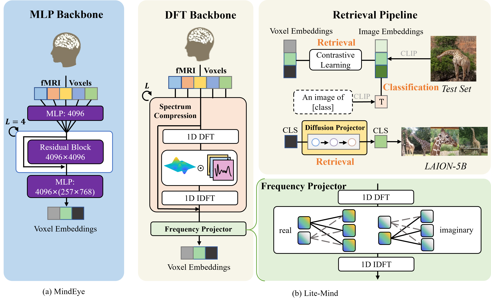

# 
Lite-Mind

This is the official code for the paper "Lite-Mind:Towards Efficient and Robust Brain Representation Learning", which is an efficient model for fMRI decoding (https://arxiv.org/abs/2312.03781).[**ACM MM 2024 Oral**]

## Data Preprocessing
1. Download nsddata, nsddata_betas, and nsddata_stimuli from NSD and place them under the nsd directory. The NSD dataset website is http://naturalscenesdataset.org/
2. 